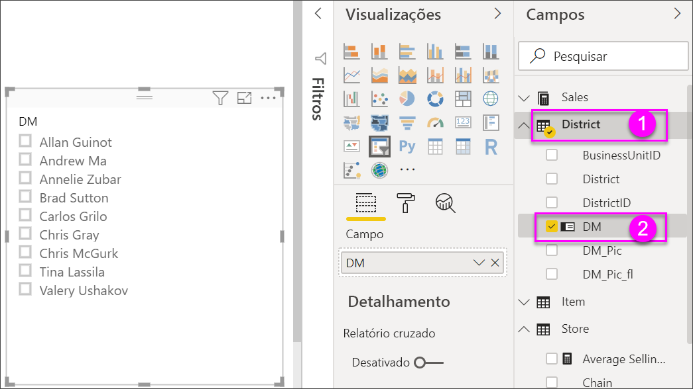
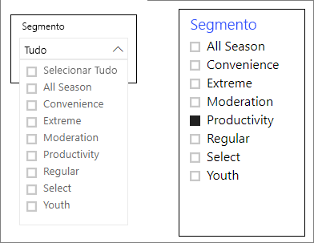
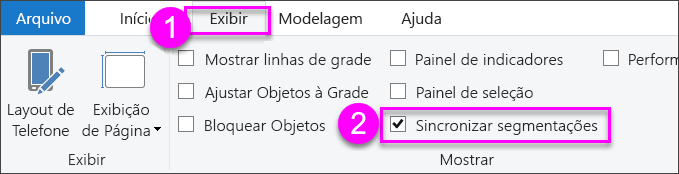
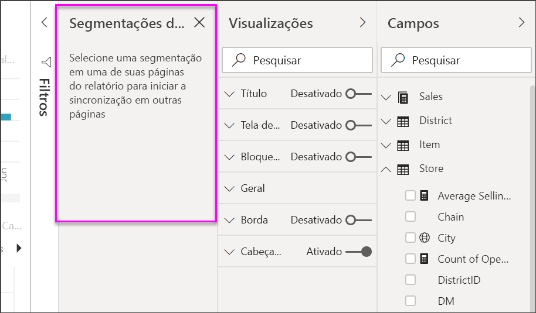
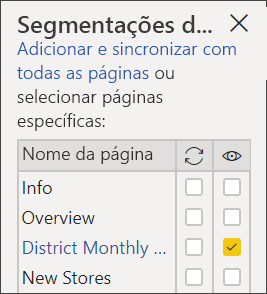
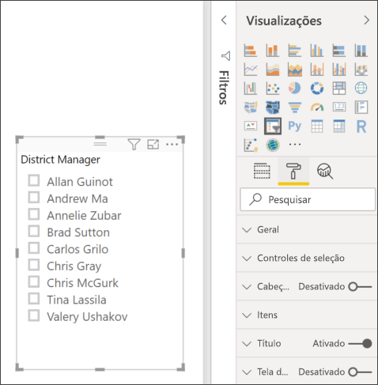
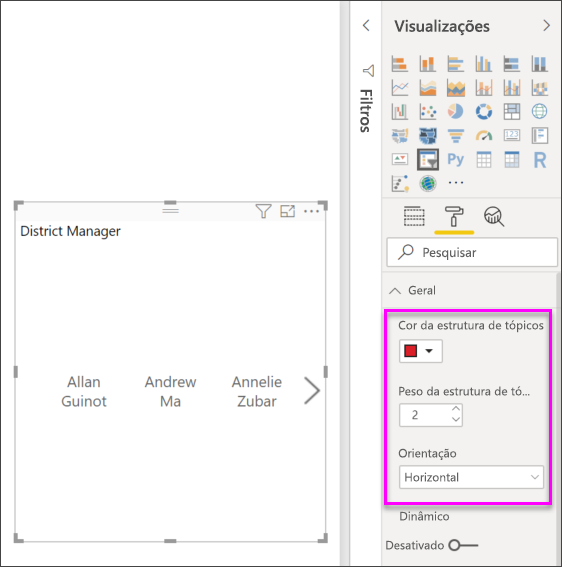
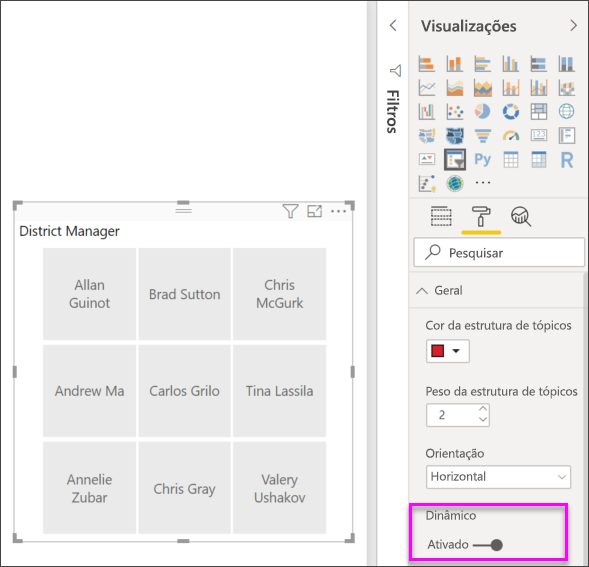
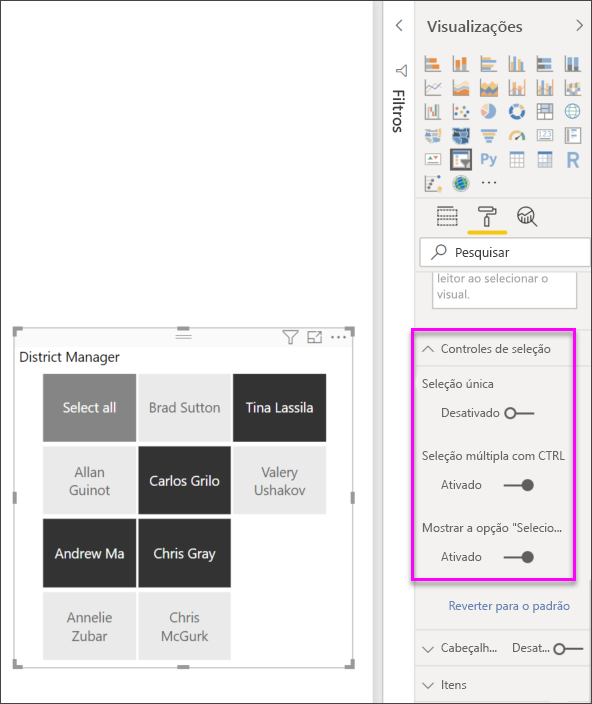
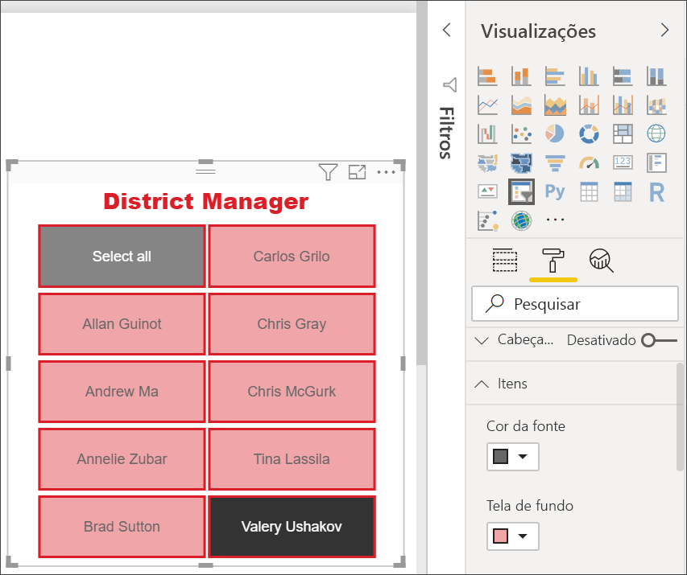

# Segmentação de Dados no Power BI

[!INCLUDE [applies-to](../includes/applies-to.md)] [!INCLUDE [yes-desktop](../includes/yes-desktop.md)] [!INCLUDE [yes-service](../includes/yes-service.md)]

Vamos supor que você deseje que seus leitores de relatório possam examinar as métricas gerais de vendas, mas também realçar o desempenho de cada gerente regional individual e em diferentes períodos. Você poderia criar relatórios separados ou gráficos comparativos. Ou então, você pode usar *segmentações*. Uma segmentação é uma forma alternativa de filtragem que restringe a parte do conjunto de dados que é mostrada em outras visualizações em um relatório. 

Este artigo descreve a criação e a formatação de uma segmentação básica usando a [Amostra gratuita de Análise de Varejo](../sample-retail-analysis.md). Também demonstra como você pode controlar os visuais afetados por uma segmentação e como sincronizá-los com segmentações em outras páginas. Veja abaixo alguns outros artigos que explicam como criar tipos específicos de segmentações:

- [Segmentações de intervalo numérico](../desktop-slicer-numeric-range.md).
- [Segmentações de data relativa](desktop-slicer-filter-date-range.md).
- [Segmentações redimensionáveis](../power-bi-slicer-filter-responsive.md) e dinâmicas.
- [Segmentações de hierarquia](../create-reports/power-bi-slicer-hierarchy-multiple-fields.md) com vários campos.

## Quando usar uma segmentação
As segmentações são uma ótima opção quando você deseja:

* Exibir os filtros mais usados ou importantes na tela do relatório para facilitar o acesso.
* Facilitar a exibição do estado atual filtrado sem precisar abrir uma lista suspensa. 
* Filtrar por colunas que são desnecessárias e que ficam ocultas nas tabelas de dados.
* Criar relatórios mais específicos, colocando as segmentações ao lado de visuais importantes.

As segmentações de dados do Power BI não dão suporte a:

- Campos de entrada
- Drill down

## Criar uma segmentação

Esta segmentação filtra os dados por gerente regional. Caso deseje acompanhar este procedimento, baixe o [arquivo PBIX de exemplo de Análise de Varejo](https://download.microsoft.com/download/9/6/D/96DDC2FF-2568-491D-AAFA-AFDD6F763AE3/Retail%20Analysis%20Sample%20PBIX.pbix).

1. Abra o Power BI Desktop e, na barra de menus, escolha **Arquivo** > **Abrir**.
   
1. Procure o arquivo **PBIX de exemplo de Análise de Varejo.pbix** e escolha **Abrir**.

1. No painel esquerdo, selecione o ícone de **Relatório** para abrir o arquivo na exibição de relatório.

1. Na página **Visa geral**, com nada selecionado na tela do relatório, selecione o ícone da **Segmentação de Dados** no painel **Visualizações** para criar uma segmentação de dados. 

1. Com a nova segmentação de dados selecionada, no painel **Campos**, selecione **Distrito** > **DM** para popular a segmentação de dados. 

    A nova segmentação de dados agora é populada com uma lista de nomes de gerente regional e suas caixas de seleção.
    
    
    
1. Redimensione e arraste os elementos na tela para liberar a espaço para a segmentação. Observe que, se você dimensionar a segmentação de dados para um formato pequeno demais, seus itens serão cortados. 

1. Selecione os nomes na segmentação de dados e observe os efeitos nas outras visualizações na página. Selecione os nomes novamente para desmarcá-los ou mantenha pressionada a tecla **Ctrl** para selecionar mais de um nome. Selecionar todos os nomes tem o mesmo efeito de não selecionar nenhum. 

1. Como alternativa, selecione **Formatar** (ícone de rolo de tinta) no painel **Visualizações** para formatar sua segmentação de dados. 

   Há muitas opções para descrever todas aqui; experimente e crie uma segmentação de dados que funcione para você. Na imagem a seguir, a primeira segmentação de dados tem uma orientação horizontal e telas de fundo coloridas para os itens. A segunda segmentação de dados tem uma orientação vertical e texto colorido para proporcionar uma aparência mais padrão.

   

   >[!TIP]
   >Os itens da lista de segmentação de dados são classificados em ordem crescente, por padrão. Para inverter a ordem de classificação para decrescente, selecione as reticências ( **…** ) no canto superior direito da segmentação e escolha **Classificação decrescente**.

## Controlar quais visuais da página são afetados pelas segmentações
Por padrão, as segmentações nas páginas de relatório afetam todas as demais visualizações na página em questão, incluindo umas às outras. Ao escolher valores nas segmentações de dados de lista e de datas criadas, observe o efeito sobre as outras visualizações. Os dados filtrados são uma interseção dos valores selecionados em ambas as segmentações. 

Use interações visuais para impedir que algumas visualizações de página sejam afetadas por outras. Na página **Visão geral**, o gráfico **Variância do total de vendas por FiscalMonth e Gerente Regional** mostra os dados comparativos gerais para os gerentes regionais por mês, que você deseja manter visíveis sempre. Use interações visuais para impedir que as seleções da segmentação de dados filtrem esse gráfico. 

1. Acesse a página **Visão geral** do relatório e selecione a segmentação de dados do **DM** que você criou anteriormente.

1. No menu do Power BI Desktop, selecione o menu **Formatar** em **Ferramentas Visuais** e, em seguida, selecione **Editar interações**.
   
   Os controles de filtro , cada um com uma opção **Filtro** e **Nenhum**, são exibidos em cima de todos os visuais na página. Inicialmente, a opção **Filtro** está previamente selecionada em todos os controles.
   
1. Selecione a opção **Nenhum** no controle de filtro em cima do gráfico **Variância do total de vendas por FiscalMonth e Gerente Regional** para impedir que a segmentação de dados **DM** o filtre. 

1. Selecione a segmentação de dados **OpenDate** e em seguida, selecione a opção **Nenhum** em cima do gráfico **Variância do total de vendas por FiscalMonth e Gerente Regional** para impedir que esta segmentação de dados o filtre. 

   Agora, ao selecionar os nomes e os intervalos de datas nas segmentações de dados, o gráfico **Variância do total de vendas por FiscalMonth e Gerente Regional** permanece inalterado.

Para obter mais informações sobre como editar interações, confira [Alterar a maneira como os visuais interagem em um relatório do Power BI](../service-reports-visual-interactions.md).

## Sincronizar e usar segmentações em outras páginas
Começando com a atualização de fevereiro de 2018 do Power BI, você pode sincronizar uma segmentação e usá-la em uma ou em todas as páginas de um relatório. 

No relatório atual, a página **Vendas Mensais Regionais** tem uma segmentação de dados **Gerente Regional**. Mas e se quiséssemos essa segmentação de dados na página **Novas Lojas**? A página **Novas Lojas** tem uma segmentação de dados, mas só fornece as informações **Nome da Loja**. Com o painel **Sincronizar segmentações de dados**, você pode sincronizar a segmentação de dados **Gerente Regional** com essas páginas, para que as seleções da segmentação em qualquer página afetem as visualizações em todas as três páginas.

1. No menu **Exibir** do Power BI Desktop, selecione **Sincronizar segmentações de dados**.

    

    O painel **Sincronizar segmentações de dados** é exibido entre os painéis **Filtros** e **Visualizações**.

    

1. Na página **Vendas Mensais Regionais** do relatório, selecione a segmentação de dados **Gerente Regional**. 

    Como você já criou uma segmentação de dados **DM** (**Gerente Regional**) na página **Visão geral**, o painel **Sincronizar segmentações de dados** é exibido da seguinte maneira:
    
    
    
1. Na coluna **Sincronizar**, selecione o painel **Sincronizar segmentações de dados** e selecione as páginas **Visão geral**, **Vendas Mensais Regionais** e **Novas Lojas**. 

    Essa seleção faz a segmentação de dados **Vendas Mensais Regionais** ser sincronizada entre essas três páginas. 
    
1. Na coluna **Visível** do painel **Sincronizar segmentações de dados**, selecione a página **Novas Lojas**. 

    Essa seleção faz a segmentação de dados **Vendas Mensais Regionais** ficar visível nessas três páginas. O painel **Sincronizar segmentações de dados** é exibido da seguinte maneira:

    

1. Observe os efeitos da sincronização da segmentação e de torná-la visível em outras páginas. Na página **Vendas Mensais Regionais**, observe que a segmentação de dados **Gerente Regional** agora mostra as mesmas seleções que a página **Visão geral**. Na página **Novas Lojas**, a segmentação de dados **Gerente Regional** agora está visível e suas seleções afetam as seleções visíveis na segmentação de dados **Nome da Loja**. 
    
    >[!TIP]
    >Embora a segmentação inicialmente apareça nas páginas sincronizadas no mesmo tamanho e posição como na página original, você pode mover, redimensionar e formatar as segmentações sincronizadas em várias páginas de forma independente. 

    >[!NOTE]
    >Se você sincronizar uma segmentação de dados com uma página, mas não a deixar visível nessa página, as seleções de segmentações feitas nas outras páginas ainda filtrarão os dados na página.
 
## Como filtrar segmentações
Você pode aplicar filtros no nível do visual às segmentações para reduzir a lista de valores exibidos na segmentação. Por exemplo, filtre os valores em branco de uma segmentação de lista ou determinadas datas de uma segmentação de intervalo. Quando você faz isso, isso só afeta *os valores mostrados na segmentação*, não *o filtro que a segmentação aplica aos outros visuais* ao fazer uma seleção. Por exemplo, digamos que você aplique um filtro a uma segmentação de intervalo para mostrar apenas determinadas datas. A seleção na segmentação mostrará apenas a primeira e a última data desse intervalo, mas você ainda verá outras datas nos outros visuais. Depois de alterar o intervalo selecionado na segmentação, você verá os outros visuais serem atualizados. A limpeza da segmentação mostrará todas as datas novamente.

Confira [Tipos de filtro](../power-bi-report-filter-types.md) para obter mais informações sobre filtros no nível do visual.

## Formatar segmentações
Diferentes opções de formatação estão disponíveis dependendo do tipo de segmentação. Usando a orientação **Horizontal**, layout **Dinâmico** e cores **Item**, você pode produzir botões ou blocos em vez de itens de lista padrão e fazer com que os itens da segmentação sejam redimensionados de acordo com diferentes tamanhos de telas e layouts.  

1. Com a segmentação de dados **Gerente Regional** selecionada em qualquer página, no painel **Visualizações**, selecione o ícone **Formatar** para exibir os controles de formatação. 
    
    
    
1. Selecione as setas da lista suspensa ao lado de cada categoria para exibir e editar as opções. 

### Opções gerais
1. Em **Formatar**, selecione **Geral**, selecione uma cor vermelha em **Cor do contorno** e altere o **Peso do contorno** para *2*. 

    Essa configuração altera a cor e a espessura do cabeçalho e os contornos e sublinhados do item.

1. Para **Orientação**, **Vertical** é o padrão selecionado. Selecione **Horizontal** para produzir uma segmentação de dados com blocos ou botões dispostos horizontalmente e role as setas para acessar itens que não cabem na segmentação de dados.
    
    
    
1. **Ative** o layout **Dinâmico** para alterar o tamanho e a disposição dos itens da segmentação de dados de acordo com o tamanho da tela de exibição e da segmentação de dados. 

    Para segmentações de lista, o layout dinâmico impede que os itens sejam cortados em telas pequenas. Ele está disponível somente em orientações horizontais. Para segmentações de controle deslizante de intervalo, a formatação dinâmica altera o estilo do controle deslizante e proporciona redimensionamento mais flexível. Ambos os tipos de segmentações se tornam ícones de filtro em tamanhos pequenos.
    
    
    
    >[!NOTE]
    >As alterações de layout dinâmico podem substituir a formatação específica de cabeçalho e de item que você definiu. 
    
1. Em **Posição X**, **Posição Y**, **Largura** e **Altura**, defina a posição e o tamanho da segmentação de dados com precisão numérica ou mova e redimensione a segmentação de dados diretamente na tela. 

    Experimente com diferentes tamanhos e disposições, e observe como a formatação dinâmica é alterada de acordo. Essas opções estarão disponíveis somente quando você selecionar orientações horizontais. 

    

Para obter mais informações sobre orientações horizontais e layouts dinâmicos, confira [Criar uma segmentação de dados dinâmica que você pode redimensionar no Power BI](../power-bi-slicer-filter-responsive.md).

### Opções de controles de seleção (somente segmentações de lista)
1. Em **Controles de seleção**, defina **Mostrar a opção "Selecionar tudo"** como **Ativado** para adicionar um item **Selecionar Tudo** à segmentação de dados. 

    **Mostrar a opção "Selecionar tudo"** está **Ativado** por padrão. Quando habilitada, essa opção, quando alternada, seleciona ou cancela a seleção de todos os itens. Se você selecionar todos os itens, selecionar um item cancelará sua seleção, permitindo um tipo de filtro *não-é*.
    
    
    
1. Defina **Seleção única** como **Desativada** para permitir que você selecione vários itens sem precisar manter pressionada a tecla **Ctrl**. 

    A **Seleção única** está **Ativada** por padrão. Marcar um item o seleciona e pressionar a tecla **Ctrl** seleciona vários itens. Selecionar um item novamente cancela sua seleção.

### Opções de título
**Título** está **Ativado** por padrão. Essa seleção mostra o nome do campo de dados na parte superior da segmentação de dados. 
- Para este artigo, formate o texto do título da seguinte maneira: 
   - **Cor da fonte**: vermelha
   - **Tamanho do texto**: **14 pt**
   - **Alinhamento**: **centro**
   - **Família de fontes**: **Arial Black**

### Opções de item (somente em segmentações de lista)
1. Para este artigo, formate as opções **Itens** da seguinte maneira:
    - **Cor da fonte**: preta
    - **Tela de fundo**: vermelho claro
    - **Tamanho do texto**: **10 pt**
    - **Família de fontes**: **Arial**
 
1. Em **Contorno**, escolha **Quadro** para desenhar uma borda ao redor de cada item com o tamanho e a cor que você definiu nas opções **Gerais**. 
    
    
    
    >[!TIP]
    >- Com **Geral** > **Orientação** > **Horizontal** selecionado, os itens desmarcados mostram o texto escolhido e as cores da tela de fundo, enquanto os itens selecionados usam o padrão do sistema, geralmente telas de fundo da cor preta com o texto em branco.
    >- Com **Geral** > **Orientação > Vertical** selecionado, os itens sempre mostram as cores selecionadas e as caixas de seleção ficam sempre pretas quando marcadas. 

### Entradas de data/numéricas e opções de controle deslizante (somente segmentações de dados de controle deslizante de intervalo)
- Para controles deslizantes de lista, as opções de entrada de dados/numérica são as mesmas que a opção **Itens**, exceto que não há opções de contorno ou sublinhado.
- As opções de **controle deslizante** permitem definir a cor do controle deslizante de intervalo ou defini-lo como **Desativado**, deixando apenas as entradas numéricas.

### Outras opções de formatação
As outras opções de formatação estão **Desativadas** por padrão. **Ative** essas opções para controlá-las: 
- **Tela de fundo**: adicionar uma cor da tela de fundo à segmentação de dados e definir a transparência.
- **Bloquear aspecto**: reter a forma da segmentação de dados se ela for redimensionada.
- **Borda**: adicionar uma borda ao redor do controle deslizante e definir sua cor. Essa borda da segmentação é separada e não é afetada pelas configurações **Gerais**. 

## Próximas etapas
Para obter mais informações, consulte os seguintes artigos:

- [Tipos de visualização no Power BI](power-bi-visualization-types-for-reports-and-q-and-a.md)

- [Tabelas no Power BI](power-bi-visualization-tables.md)

