# Tabelas em relatórios e dashboards do Power BI

[!INCLUDE[consumer-appliesto-nyyn](../includes/consumer-appliesto-nyyn.md)]

[!INCLUDE [power-bi-visuals-desktop-banner](../includes/power-bi-visuals-desktop-banner.md)]

Uma tabela é uma grade que contém dados relacionados em uma série de lógica de linhas e colunas. Ela também pode conter cabeçalhos e linhas de totais. As tabelas funcionam bem com comparações quantitativas em que você observa muitos valores de uma única categoria. Por exemplo, esta tabela exibe cinco medidas diferentes para a **Categoria**.

Crie tabelas em relatórios e elementos com realce cruzado dentro da tabela com outros visuais na mesma página de relatório. Você pode selecionar linhas, colunas e até mesmo células individuais e realce cruzado. Além disso, é possível copiar e colar a células individuais e várias seleções de célula em outros aplicativos.

## Quando usar uma tabela

As tabelas são uma ótima opção:

* Para ver e comparar dados detalhados e valores exatos (em vez de representações visuais).

* Para exibir dados em um formato tabular.

* Para exibir dados numéricos por categorias.

## Pré-requisito

Este tutorial usa o [arquivo PBIX de exemplo de Análise de Varejo](https://download.microsoft.com/download/9/6/D/96DDC2FF-2568-491D-AAFA-AFDD6F763AE3/Retail%20Analysis%20Sample%20PBIX.pbix).

1. Na seção superior esquerda da barra de menus, selecione **Arquivo** > **Abrir**
   
2. Encontre sua cópia do **arquivo PBIX de exemplo de Análise de Varejo**

1. Abra o **arquivo PBIX de exemplo de Análise de Varejo** na exibição de relatório .

1. Selecionar  para adicionar uma nova página.

> [!NOTE]
> Compartilhar seu relatório com um colega do Power BI exige que você tenha licenças de Power BI Pro individuais ou que o relatório seja salvo na capacidade Premium.

## Criar uma tabela

Crie a tabela mostrada no início do artigo para exibir valores de vendas por categoria de item.

1. No painel **Campos**, selecione **Item** > **Categoria**.

    O Power BI cria automaticamente uma tabela que lista todas as categorias.

    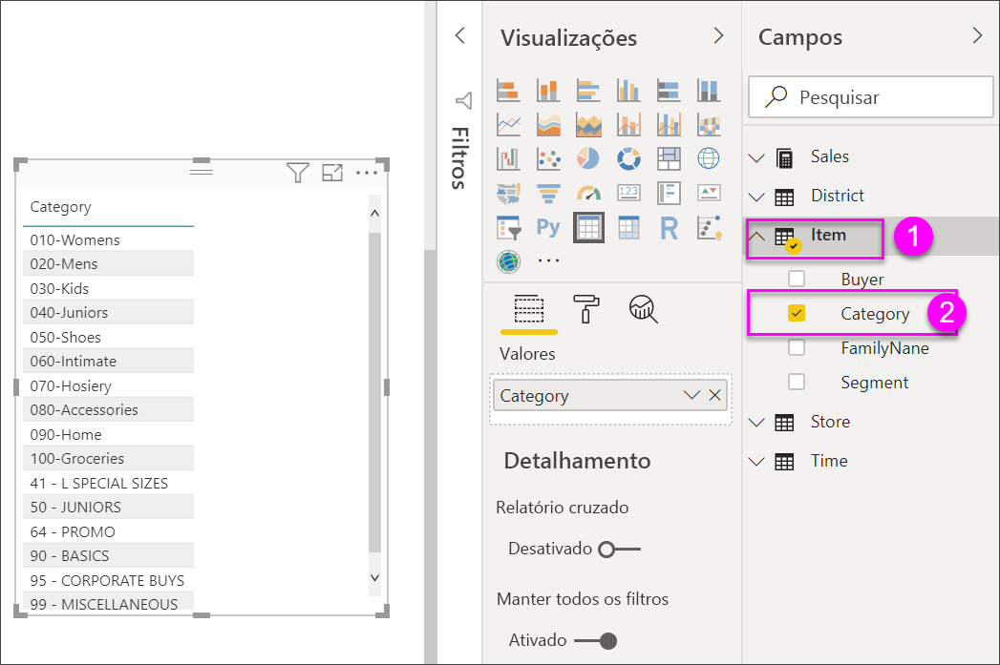

1. Selecione **Vendas > Preço da unidade médio** e **Vendas > Vendas do ano passado**

1. Em seguida, selecione **Vendas > Vendas deste ano** e selecione todas as três opções: **Valor**, **Meta** e **Status**.

1. No painel de **Visualizações**, localize a caixa **Valores** e selecione os valores até que a ordem das colunas do gráfico correspondam à primeira imagem nesta página. Arraste os valores na caixa, se necessário. A caixa **Valores** deve ficar com esta aparência:

    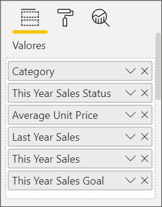

## Formatar a tabela

Há muitas maneiras de formatar uma tabela. Apenas algumas são abordadas aqui. Uma ótima maneira de conhecer outras opções de formatação é abrir o painel **Formato** (ícone de rolo de pintura ) e explorar.

* Experimente formatar a grade de tabela. Aqui você adicionará uma grade vertical azul, espaço às linhas, aumentará a estrutura de tópicos e o tamanho do texto.

    

    

* Para os cabeçalhos da coluna, altere a cor da tela de fundo, adicione uma estrutura de tópicos e aumente o tamanho da fonte.

    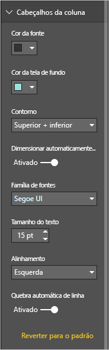

    

* Você pode até mesmo aplicar formatação a colunas individuais e cabeçalhos de coluna. Comece expandindo **Formatação de campo** e selecionando a coluna para formatar na lista suspensa. Dependendo dos valores de coluna, a **Formatação de campo** permite definir coisas como: unidades de exibição, cor da fonte, o número de casas decimais, plano de fundo, alinhamento e muito mais. Depois que você tiver ajustado as configurações, decida se deseja aplicar essas configurações também para o cabeçalho e a linha de totais.

    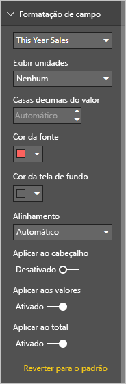

    

* Depois de uma formatação adicional, veja nossa tabela definitiva.

    

### Formatação condicional

*Formatação condicional* é um tipo de formatação. O Power BI pode aplicar a formatação condicional a qualquer um dos campos que você adicionou à seção **Valores** do painel **Visualizações**.

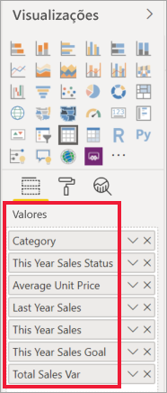

Com a formatação condicional para tabelas, você pode especificar ícones, URLs, cores de tela de fundo das células e cores das fontes com base nos valores da célula, inclusive usando cores de gradiente.

1. No painel **Formato**, abra o cartão **Formatação condicional**.

    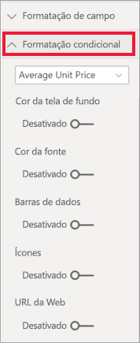

1. Selecione um campo para ser formatado e ative o controle deslizante da **Cor da tela de fundo**. O Power BI aplica um gradiente com base nos valores da coluna. Para alterar as cores padrão, selecione **Controles avançados**.

    Se selecionar a opção **Divergente**, você também poderá configurar um valor opcional para o **Centro**.

    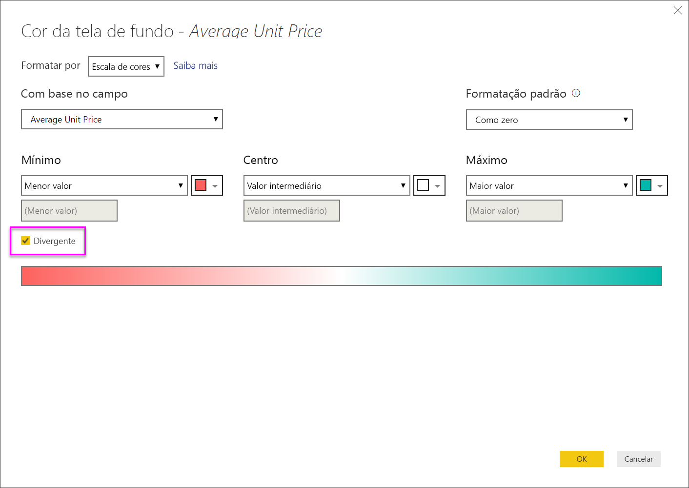

    Vamos aplicar uma formatação personalizada aos valores de Preço unitário médio. Selecione **Divergente**, adicione algumas cores e selecione **OK**.

    
1. Adicione um novo campo à tabela que tem valores positivos e negativos. Selecione **Campos > Variação do Total de Vendas**.

    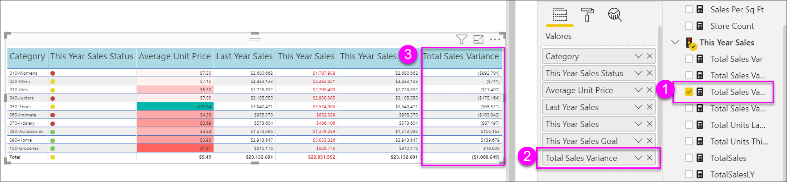

1. Adicione a formatação condicional da barra de dados ativando o controle deslizante **Barras de dados**.  

    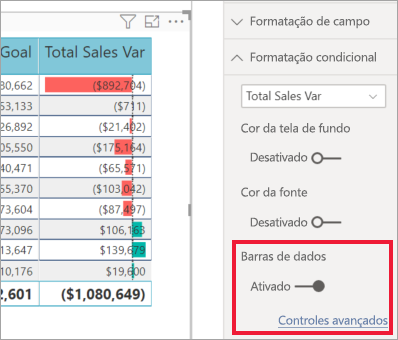

1. Para personalizar as barras de dados, selecione **Controles avançados**. Na caixa de diálogo exibida, defina cores para **Barra positiva**, **Barra negativa**, selecione a opção **Mostrar apenas a barra** e faça outras alterações desejadas.

    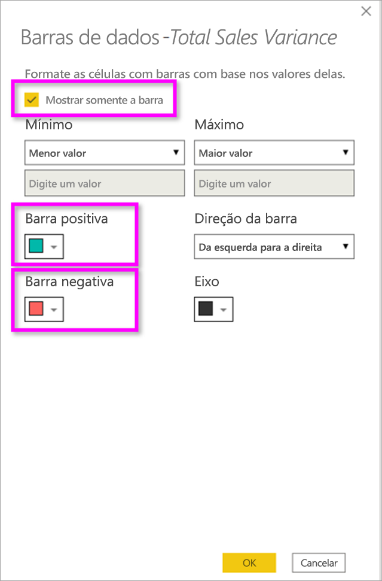

1. Selecione **OK**.

    As barras de dados substituem os valores numéricos na tabela, facilitando a verificação.

    

1. Adicione indicações visuais à tabela com os *ícones condicionais*.  No cartão **Formatação condicional**, selecione **Vendas deste ano** no menu suspenso. Deixe o controle deslizante **Ícones** **Ativado**.  Para personalizar os ícones, selecione **Controles avançados**.

    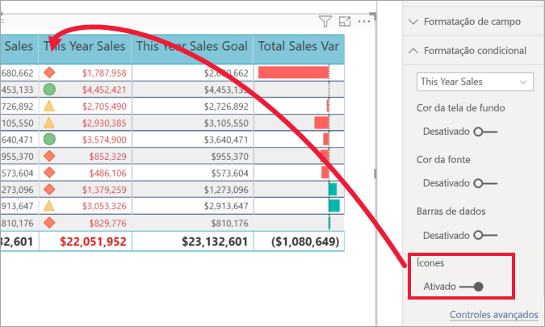

## Copiar valores de tabelas do Power BI para uso em outros aplicativos

Sua tabela ou matriz pode ter conteúdo que você gostaria de usar em outros aplicativos, como Dynamics CRM, Excel e até mesmo outros relatórios do Power BI. No Power BI, ao clicar com o botão direito do mouse em uma célula, é possível copiar os dados em uma única célula ou uma seleção de células em sua área de transferência e colar em outros aplicativos.

Para copiar o valor de uma única célula:

1. Selecione a célula que você deseja copiar.

1. Clique com o botão direito do mouse na célula.

1. Selecione **Copiar** > **Copiar valor**.

    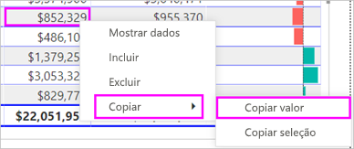

    Com o valor de célula não formatado em sua área de transferência, é possível colá-lo em outro aplicativo.

Para copiar mais de uma única célula:

1. Selecione uma variedade de células ou use **Ctrl** para selecionar uma ou mais células.

1. Clique com botão direito do mouse em uma das células selecionadas.

1. Selecione **Copiar** > **Copiar seleção**.

    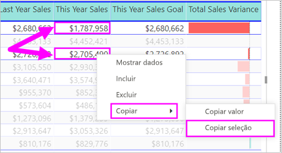

## Ajustar a largura da coluna de uma tabela

Às vezes, o Power BI vai truncar um título de coluna em um relatório e em um painel. Para mostrar todo o nome da coluna, passe o mouse sobre o espaço à direita do título para revelar as setas duplas, selecionar e arrastar.

## Considerações e solução de problemas

* Ao aplicar a formatação de coluna, só é possível escolher uma opção de alinhamento por coluna: **Automático**, **Esquerda**, **Centro**, **Direita**. Normalmente, uma coluna contém todo o texto ou todos os números, e não uma combinação. Nos casos em que uma coluna contiver números e texto, **Auto** será alinhado à esquerda para texto e à direita para números. Esse comportamento dá suporte a idiomas em que a leitura ocorre da esquerda para a direita.

* Se os dados de texto nos cabeçalhos ou nas células da sua tabela contiverem novos caracteres de linha, esses caracteres serão ignorados, a menos que você habilite a opção "Quebra Automática de Linha" no cartão associado do painel de formatação do elemento. 

## Próximas etapas

* [Mapas de árvore no Power BI](power-bi-visualization-treemaps.md)

* [Tipos de visualização no Power BI](power-bi-visualization-types-for-reports-and-q-and-a.md)
