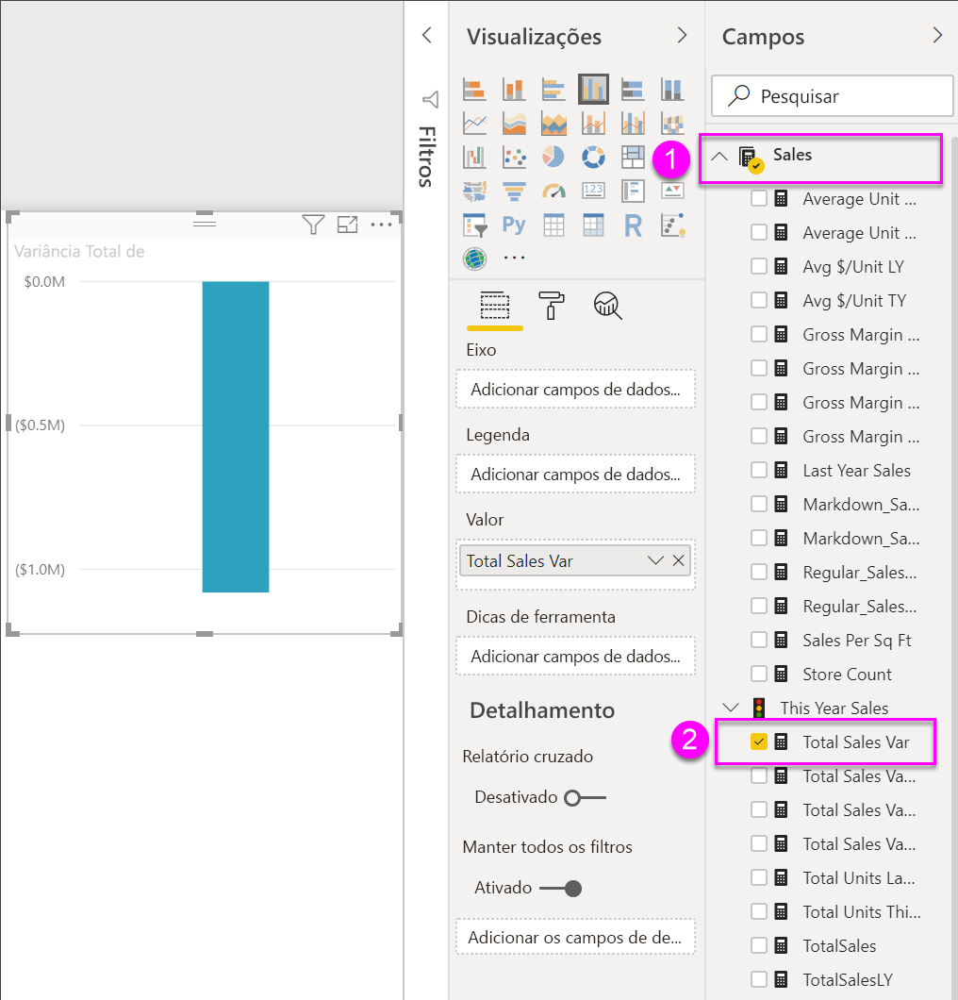
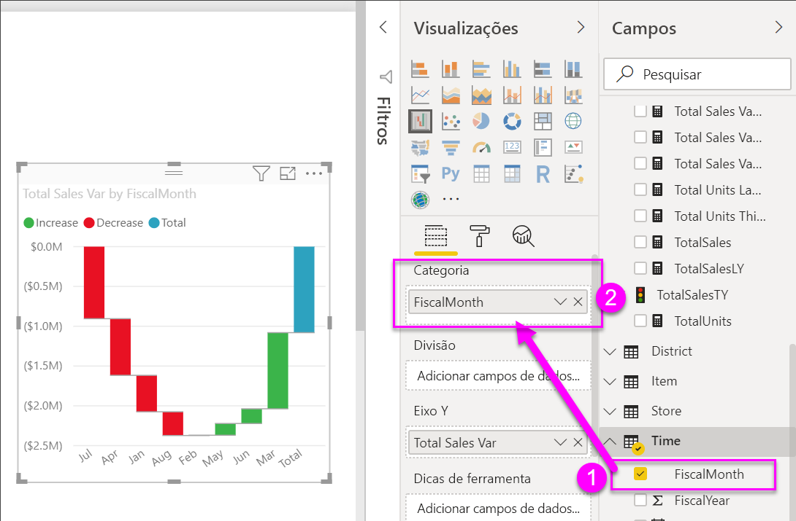
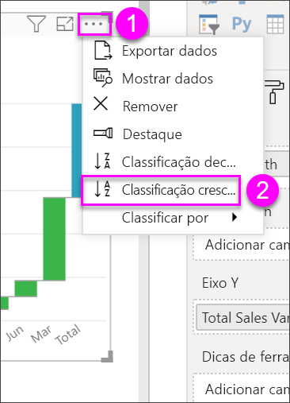
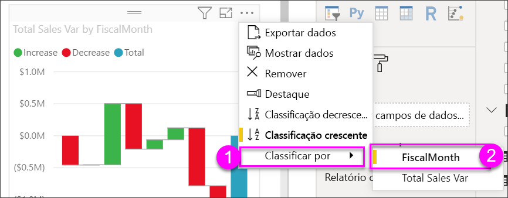
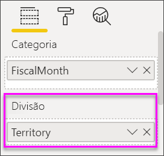
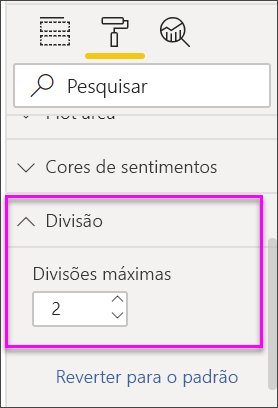

# Gráficos de cascata no Power BI

[!INCLUDE [power-bi-visuals-desktop-banner](../includes/power-bi-visuals-desktop-banner.md)]

Os gráficos de cascata mostram o total em execução à medida que o Power BI adiciona ou subtrai valores. São úteis para entender como um valor inicial (como a receita líquida) é afetado por uma série de alterações positivas e negativas.

As colunas são codificadas por cores para que você possa notar rapidamente aumentos e diminuições. As colunas dos valores inicial e final às vezes [começam no eixo horizontal](https://support.office.com/article/Create-a-waterfall-chart-in-Office-2016-for-Windows-8de1ece4-ff21-4d37-acd7-546f5527f185#BKMK_Float "iniciar no eixo horizontal"), enquanto os valores intermediários são colunas flutuantes. Devido a esse estilo, os gráficos de cascata também são chamados de gráficos de ponte.

   > [!NOTE]
   > Este vídeo usa uma versão mais antiga do Power BI Desktop.
   > 
   > 

<iframe width="560" height="315" src="https://www.youtube.com/embed/qKRZPBnaUXM" frameborder="0" allow="autoplay; encrypted-media" allowfullscreen></iframe>

## Ao usar um gráfico de cascata

Os gráficos de cascata são uma ótima opção:

* Quando houver alterações para a medida ao longo do tempo, uma série ou categorias diferentes.

* Para auditar as principais alterações que contribuem para o valor total.

* Para traçar o lucro anual da empresa, mostrando várias fontes de receita e chegar ao lucro total (ou perda).

* Para ilustrar o início e final do número de funcionários de sua empresa em um ano.

* Para visualizar o quanto você ganha e gasta mensalmente, e o saldo parcial da sua conta.

## Pré-requisito

Este tutorial usa o [arquivo PBIX de exemplo de Análise de Varejo](https://download.microsoft.com/download/9/6/D/96DDC2FF-2568-491D-AAFA-AFDD6F763AE3/Retail%20Analysis%20Sample%20PBIX.pbix).

1. Na seção superior esquerda da barra de menus, selecione **Arquivo** > **Abrir**
   
2. Encontre sua cópia do **arquivo PBIX de exemplo de Análise de Varejo**

1. Abra o **arquivo PBIX de exemplo de Análise de Varejo** na exibição de relatório .

1. Selecionar  para adicionar uma nova página.

## Criar um gráfico de cascata

Crie um gráfico de cascata que exibe a variação de vendas (vendas estimadas versus vendas reais) por mês.

1. No painel **Campos**, selecione **Vendas** > **Variação do Total de Vendas**.

   

1. Selecione o ícone de cascata 

    

1. Selecione **Hora** > **FiscalMonth** para adicioná-la à caixa **Categoria**.

    

1. Verifique se o Power BI classificou o gráfico de cascata em ordem cronológica. No canto superior direito do gráfico, selecione **Mais opções** (...).

    Para este exemplo, selecionaremos **Classificar em ordem crescente**

    Verifique se há um indicador amarelo ao lado esquerdo de **Classificar em ordem crescente.** Isso indica que a opção selecionada está sendo aplicada.

    

    Em seguida, vamos clicar em **Classificar por** e selecionar **FiscalMonth**. Assim como na etapa anterior, um indicador amarelo ao lado de sua seleção indica quando sua opção de seleção está sendo aplicada.

    

    Você também pode examinar os valores do eixo X e ver se estão na ordem de **Jan** à **Ago**.

    Aprofunde-se um pouco mais para ver o que está contribuindo mais para as alterações a cada mês.

1.  Selecione **Repositório** > **Território**, que adicionará **Território** ao bucket **Divisão**.

    

    Por padrão, o Power BI adiciona os cinco principais colaboradores a aumentos ou diminuições por mês. A imagem abaixo expandiu nosso painel de visualização para incluir mais dados. 

    

    Você está interessado apenas nos dois colaboradores principais.

1. No painel **Formato**, selecione **Divisão** e defina **Divisões máximas** para **2**.

    

    Uma rápida análise revela que as regiões de Ohio e Pensilvânia são os maiores colaboradores para a movimentação, negativa e positiva, em nosso gráfico de cascata.

    

## Próximas etapas

* [Alterar como os visuais interagem em um relatório do Power BI](../service-reports-visual-interactions.md)

* [Tipos de visualização no Power BI](power-bi-visualization-types-for-reports-and-q-and-a.md)
