# Introdução ao painel de formatação

[!INCLUDE[consumer-appliesto-nyyn](../includes/consumer-appliesto-nyyn.md)]    

Se você tem permissões de edição para um relatório, há várias opções de formatação disponíveis. Nos relatórios do Power BI, você pode alterar a cor da série de dados, dos pontos de dados e até mesmo da tela de fundo das visualizações. Você pode alterar a forma como os eixos x e y são apresentados. Também é possível formatar as propriedades de fonte de visualizações, formas e títulos. O Power BI oferece controle total sobre como seus relatórios são exibidos.

Para começar, abra um relatório no Power BI Desktop ou no serviço do Power BI. Ambos oferecem opções de formatação quase idênticas. Ao abrir um relatório no serviço do Power BI, selecione **Editar** na barra de menus. 

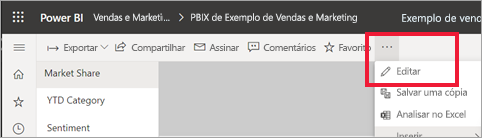

Enquanto você edita um relatório com uma visualização selecionada, o painel de **Visualizações** é exibido. Use esse painel para alterar as visualizações. Diretamente abaixo do painel de **Visualizações**, você verá três ícones: o ícone de **Campos** (uma pilha de barras), o ícone de **Formato** (um rolo de pintura) e o ícone do **Analytics** (uma lupa). Na imagem abaixo, o ícone de **Campos** está selecionado, o que é indicado por uma barra amarela abaixo do ícone.

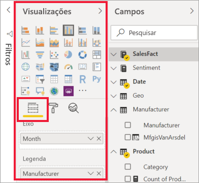

Quando você seleciona **Formato**, a área abaixo do ícone exibe as personalizações disponíveis para a visualização selecionada no momento.  

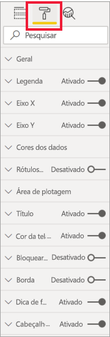

Você pode personalizar muitos elementos de cada visualização. As opções disponíveis dependem do visual selecionado. Veja a seguir algumas dessas opções:

* Legenda
* Eixo X
* Eixo Y
* Cores de dados
* Rótulos de dados
* Formas
* Área de plotagem
* Título
* Tela de fundo
* Bloquear aspecto
* Borda
* Dicas de ferramenta
* Cabeçalhos de visual
* Formas
* Posição    
e mais.

> [!NOTE]
>  
> Você não verá todos esses elementos com cada tipo de visualização. A visualização que você selecionar afetará quais personalizações estão disponíveis; por exemplo, você não verá um eixo X se tiver selecionado um gráfico de pizza porque não há eixo x em um gráfico de pizza.

Observe também que, se você não tiver nenhuma visualização selecionada, será exibido **Filtros** em vez dos ícones, o que permite aplicar filtros a todas as visualizações na página.

A melhor maneira de aprender a usar as opções de formatação é testá-las. Você pode desfazer suas alterações ou reverter para o padrão a qualquer momento. Há uma quantidade incrível de opções disponíveis, e novas opções são adicionadas o tempo todo. Não é possível descrever todas as opções de formatação em um artigo. Mas, como ponto de partida, vamos analisar algumas delas. 

1. Alterar cores usadas no visual   
2. Aplicar um estilo    
3. Alterar propriedades do eixo    
4. Adicionar rótulos de dados    

## Trabalhando com cores

Vamos seguir as etapas necessárias para personalizar as cores em uma visualização.

1. Selecione a visualização para ativá-la.

2. Selecione o ícone de rolo de pintura para abrir a guia Formatação. A guia Formatação exibe todos os elementos de formatação disponíveis para o visual selecionado.

    

3. Selecione **Cores dos Dados** para expandir as personalizações disponíveis.  

    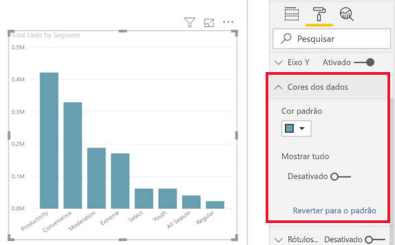

4. Altere **Mostrar tudo** para Ativado e selecione diferentes cores para as colunas.

    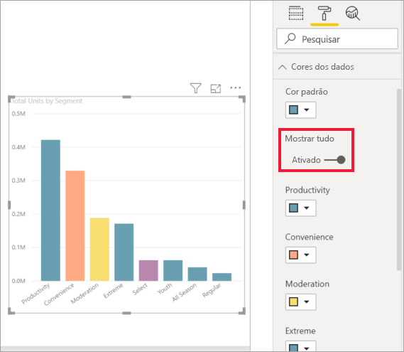

Veja a seguir algumas dicas úteis para trabalhar com cores. Os números na lista a seguir também são mostrados na tela seguinte, indicando onde esses elementos úteis podem ser acessados ou alterados.

1. Não gostou da cor? Não tem problema, basta selecionar **Reverter para o padrão** para voltar à configuração padrão. 

2. Não gosta de nenhuma das mudanças de cor? Selecione **Reverter para o padrão**, na parte inferior da seção **Cor dos dados**, para reverter para a configuração padrão. 

3. Quer uma cor que não vê na paleta? Basta selecionar **Cor personalizada**e escolha uma no espectro.  

   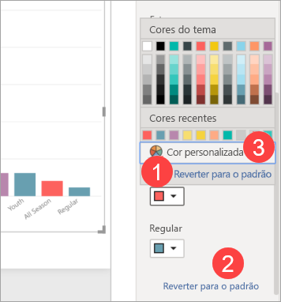

Não gostou da alteração que acabou de criar? Use **CTRL + Z** para desfazer, exatamente do modo que você está acostumado a fazer.

## Aplicar um estilo a uma tabela
Algumas visualizações do Power BI têm uma opção **Estilo**. Com um clique, um conjunto completo de opções de formatação é aplicado à sua visualização de uma só vez. 

1. Selecione uma tabela ou matriz para ativá-la.   
1. Abra a guia Formatação e selecione **Estilo**.

   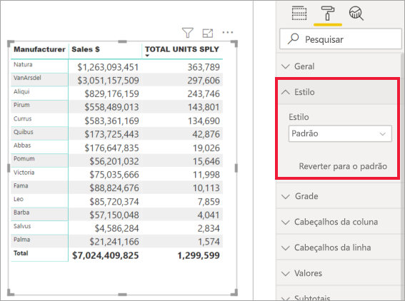

1. Selecione um estilo no menu suspenso. 

   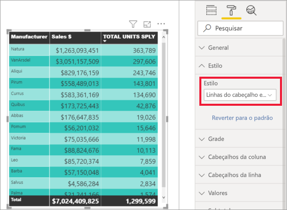

Mesmo depois de aplicar um estilo, você pode continuar a formatar as propriedades, incluindo cores, dessa visualização.

## Alterando as propriedades de eixo

Geralmente é útil modificar o eixo X ou Y. Semelhante ao trabalho com cores, você pode modificar um eixo selecionando o ícone de seta para baixo à esquerda do eixo que você deseja alterar, como mostrado na imagem a seguir.  
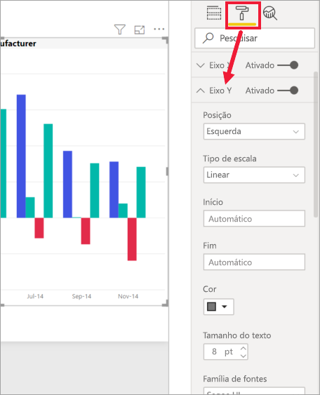

No exemplo abaixo, formatamos o eixo Y da seguinte forma:
- movendo os rótulos para o lado direito da visualização

- alterando o valor inicial para zero.

- alterando a cor da fonte do rótulo para preto

- aumentando o tamanho da fonte do rótulo para 12

- adicionando um título de eixo Y

    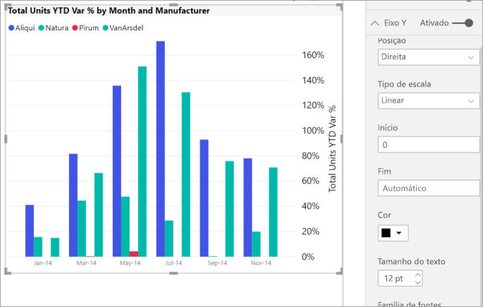

Você pode remover completamente os rótulos dos eixos alternando o botão de opção ao lado de **Eixo X** ou **Eixo Y**. Você pode também optar por ativar ou desativar os títulos dos eixos selecionando o botão de opção ao lado de **Título**.  

## Adicionar rótulos de dados    

Um último exemplo de formatação antes de começar a explorar por conta própria.  Vamos adicionar rótulos de dados a um gráfico de áreas. 

Aqui está a imagem do *antes*. 

E aqui está a foto do *depois*.

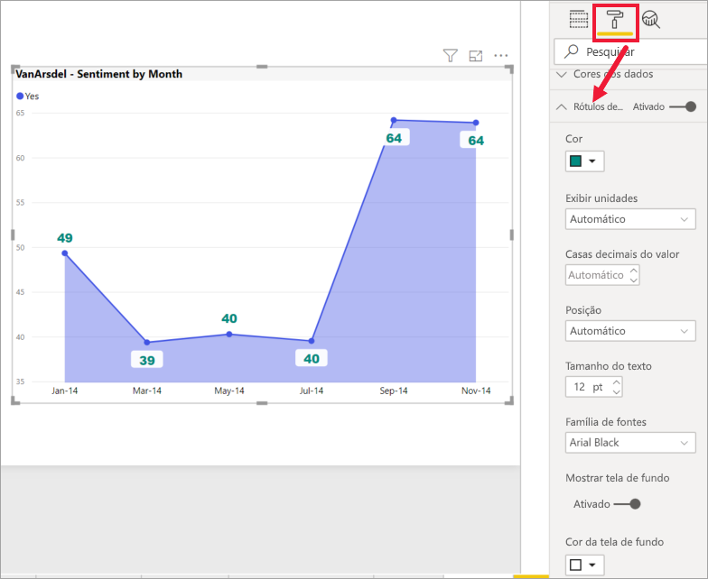

Selecionamos a visualização para ativá-la e abrimos a guia Formatação.  Selecionamos a opção **Rótulos de dados** e a ativamos. Em seguida, aumentamos a fonte para 12, alteramos a família de fontes para Arial Black, ativamos a opção **Mostrar tela de fundo** e mudamos a cor da tela de fundo para branco com uma transparência de 5%.

Essas são apenas algumas das tarefas de formatação possíveis. Abra um relatório no modo de edição e divirta-se explorando o painel Formatação para criar visualizações lindas e informativas.

## Próximas etapas
Para obter mais informações, consulte o seguinte artigo: 

* [Compartilhamento de relatórios](../collaborate-share/service-share-reports.md)

* [Dicas e truques para formatação com cores no Power BI](service-tips-and-tricks-for-color-formatting.md)  
* [Formatação condicional em tabelas](../create-reports/desktop-conditional-table-formatting.md)

