# Dicas e truques para formatação com cores no Power BI

[!INCLUDE[consumer-appliesto-nyyn](../includes/consumer-appliesto-nyyn.md)]    

O Power BI fornece diversas maneiras de personalizar os painéis e relatórios. Este artigo detalha uma coleção de dicas que podem tornar suas visualizações do Power BI mais convincentes, interessantes e personalizadas para suas necessidades.

As dicas a seguir são fornecidas. Há outra dica excelente? Ótimo! Envie para nós e vermos sobre adicioná-la à lista.

* Aplicar um tema a todo o relatório
* Alterar a cor de um único ponto de dados
* Formatação condicional
* Basear as cores de um gráfico em um valor numérico
* Base da cor de pontos de dados no valor de campo
* Personalizar as cores usadas na escala de cores
* Usar escalas de cores divergentes
* Adicionar cor às linhas da tabela
* Como desfazer no Power BI

Para fazer qualquer alteração, você deve ter permissões de edição para o relatório. No Power BI Desktop, abra o relatório na exibição de **Relatório**. No serviço do Power BI, isso significa abrir o relatório e selecionar **Editar** na barra de menus, como mostrado na imagem a seguir.

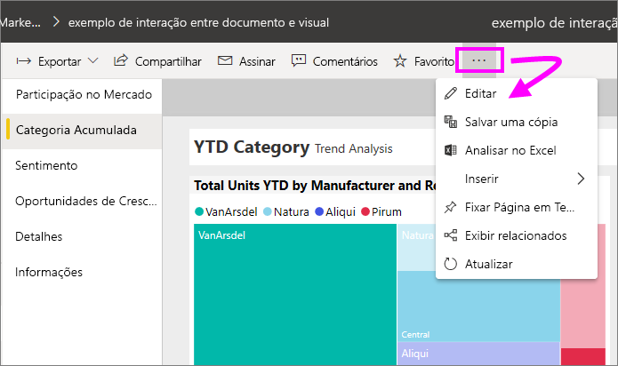

Quando os painéis **Filtros** e **Visualizações** são exibidos no lado direito da tela de relatório, você estará pronto para começar a personalizar. Se o painel não aparecer, selecione a seta no canto superior direito para abri-lo.

## Aplicar um tema
Com os temas de relatório, você pode aplicar alterações no design de seu relatório inteiro para, por exemplo, usar cores corporativas, alterar conjuntos de ícones ou aplicar uma nova formatação visual padrão. Quando você aplica um tema de relatório, todos os elementos visuais do relatório passam a usar as cores e a formatação do tema selecionado. Para saber mais, confira [Usar temas de relatório](../create-reports/desktop-report-themes.md)

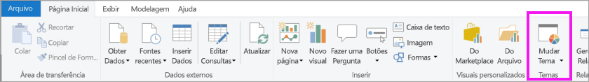

Aqui, aplicamos o tema **Inovação** ao relatório de Vendas e Marketing.

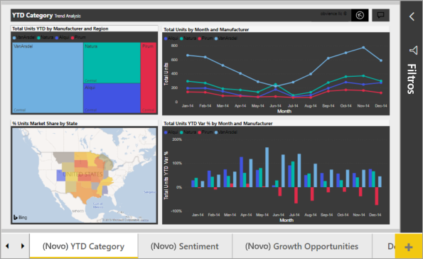

## Alterar a cor de um único ponto de dados
Às vezes você deseja realçar um determinado ponto de dados. Talvez seja um número de vendas para o lançamento de um novo produto ou as pontuações de qualidade aumentadas depois do lançamento de um novo programa. Com o Power BI, você pode realçar um determinado ponto de dados alterando sua cor.

A seguinte visualização classifica as unidades vendidas por segmento de produto. 

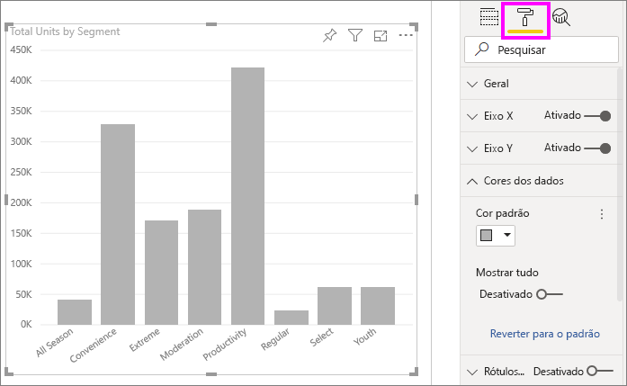

Agora, imagine que você deseja chamar o segmento **Conveniência** para mostrar o desempenho de um segmento inteiramente novo usando cor. Aqui estão as etapas para fazer isso:

Expanda o cartão **Cores dos dados** e ative o controle deslizante para **Mostrar tudo**. Isso exibe as cores para cada elemento de dados na visualização. Agora é possível modificar qualquer um dos pontos de dados.

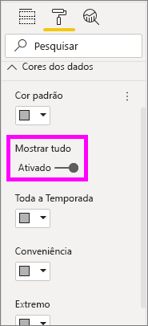

Defina **Conveniência** como laranja. 

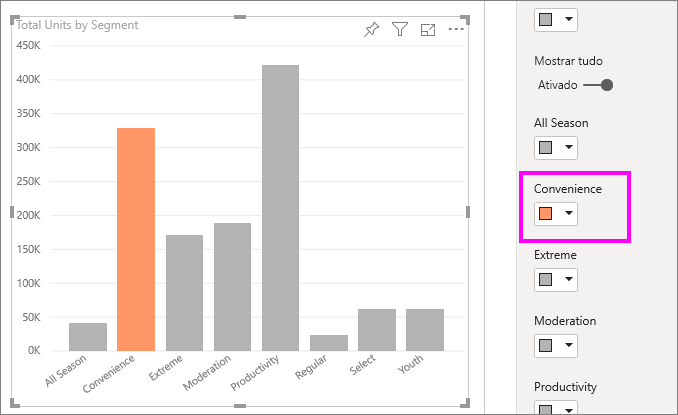

Depois de selecionado, o ponto de dados **Conveniência** aparece na cor laranja e definitivamente se sobressai.

Mesmo se você alterar os tipos de visualização e, em seguida, retornar, o Power BI lembrará a sua seleção e manterá **Conveniência** em laranja.

É possível alterar a cor de um ponto de dados para um, vários ou todos os elementos de dados na visualização. Talvez você queira que seu visual se assemelhe às cores corporativas amarelo, verde e azul. 

Há inúmeras coisas que você pode fazer com o Power BI Desktop. Na próxima seção, vamos analisar a formatação condicional.

## Formatação condicional para visualizações
As visualizações muitas vezes se beneficiam de configurar a cor com base no valor numérico de um campo. Ao fazer isso, você pode mostrar um valor diferente para que é usado o tamanho de uma barra e mostrar dois valores em um único gráfico. Ou você pode usar isso para realçar pontos de dados acima (ou abaixo) de um determinado valor – talvez destacando lucratividade baixa.

As seções a seguir demonstram maneiras diferentes de cor de base em um valor numérico.

### Base da cor de pontos de dados em um valor
Para alterar a cor com base em um valor, selecione uma visualização para torná-la ativa. Abra o painel de formatação selecionando o ícone do rolo de pintura e abra o cartão **Cores dos dados**. Passe o mouse sobre o cartão e selecione os três pontos verticais que aparecem e escolha **Formatação condicional**.  

No painel de **Cores padrão**, use os menus suspensos para identificar os campos que serão usados para formatação condicional. Neste exemplo, selecionamos o campo **Fatos de vendas** > **Unidades Totais** e selecionamos azul-claro para **Valor mais baixo** e azul-escuro para **Valor mais alto**. 

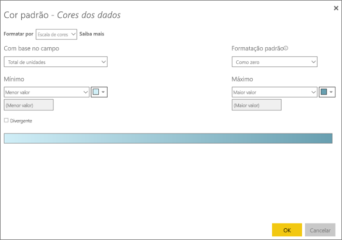

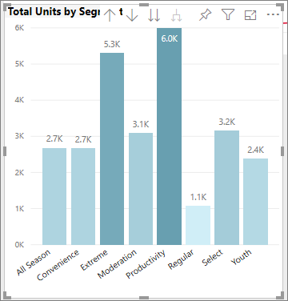

Você também pode formatar a cor do visual usando um campo que não faz parte do visual. Na imagem a seguir **% de Participação no Mercado SPLY YTD** está sendo usado. 

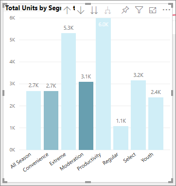

Como podemos ver, embora tenhamos vendido mais unidades de **Produtividade** e **Extremo** (as colunas mais altas), **Moderação** tem uma **% de Participação no Mercado SPLY YTD** maior (sua coluna tem mais saturação de cor).

### Personalizar as cores usadas na escala de cores
Você também pode alterar a maneira como os valores mapeiam essas cores. Na imagem a seguir, as cores **mínimo** e **máximo** são definidas como laranja e verde, respectivamente.

Nesta primeira imagem, observe como as barras no gráfico refletem o gradiente mostrado na barra; o valor mais alto é verde, o mais baixo é laranja e cada barra é colorida com um tom do espectro entre verde e laranja.

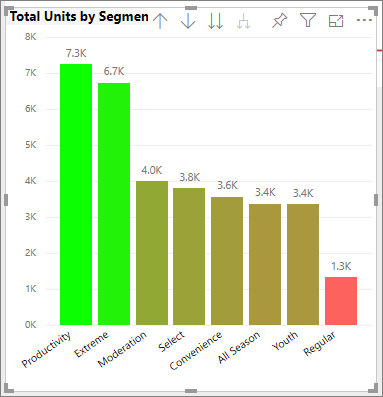

Agora, vejamos o que acontecerá se fornecermos valores numéricos nas caixas de valor **Mínimo** e **Máximo**. Selecione **Personalizado** nas caixas suspensas para **Mínimo** e **Máximo** e defina **Mínimo** como 3.500 e **Máximo** como 6.000.

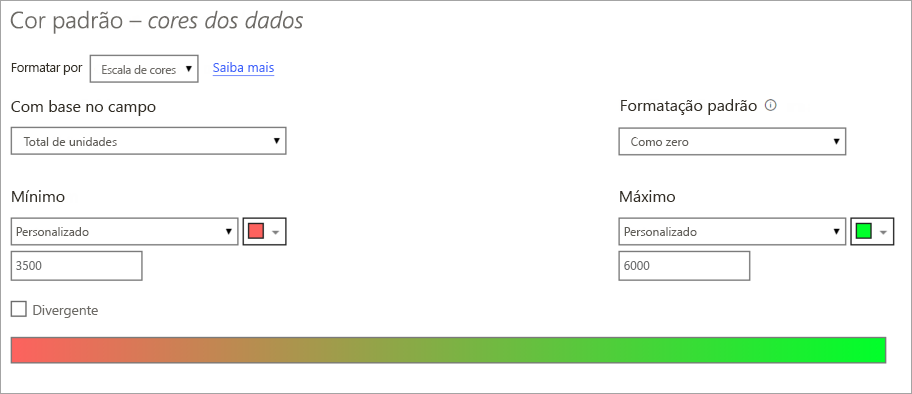

Ao definir esses valores, gradiente não é mais aplicado a valores no gráfico que estão abaixo do **mínimo** ou acima do **máximo**; qualquer barra com um valor acima do valor **máximo** é verde e qualquer barra com um valor baixo do **mínimo** fica em vermelho.

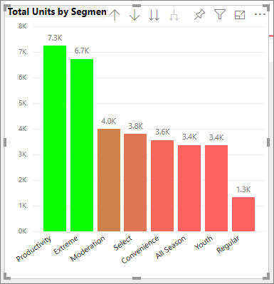

### Usar escalas de cores divergentes
Às vezes, seus dados podem ter uma escala divergente naturalmente. Por exemplo, um intervalo de temperatura tem um centro natural em congelamento de ponto e uma pontuação de lucratividade tem um ponto intermediário natural (zero).

Para usar as escalas de cores divergentes, marque a caixa de seleção para **Divergente**. Quando **Divergente** estiver ativado, um seletor de cores adicionais, chamado **Centro**, será exibido, conforme mostrado na imagem a seguir.

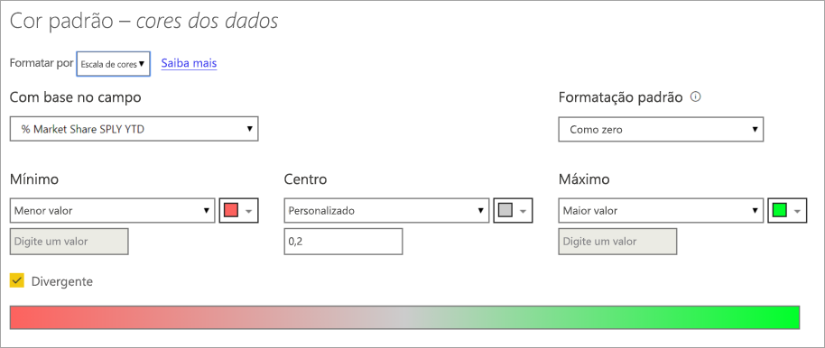

Quando o controle deslizante **Divergente** estiver ativo, você pode definir as cores **mínimo**, **máximo** e **centro** separadamente. Na imagem a seguir, **Centro** está definido como 0,2 para **% de Participação no Mercado SPLY YTD**, então as barras com valores acima de 0,2 são uma tonalidade gradiente de verde e as barras abaixo são tons de vermelho.

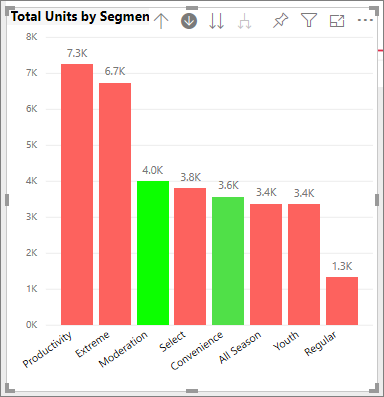

## Adicionar cor às linhas da tabela
Tabelas e matrizes oferecem muitas opções para formatação de cores. 

Uma das maneiras mais rápidas de aplicar cores a uma tabela ou matriz é abrir a guia Formatação e selecionar **Estilo**.  Na imagem abaixo, selecionamos **Linhas do cabeçalho em negrito que piscam**.

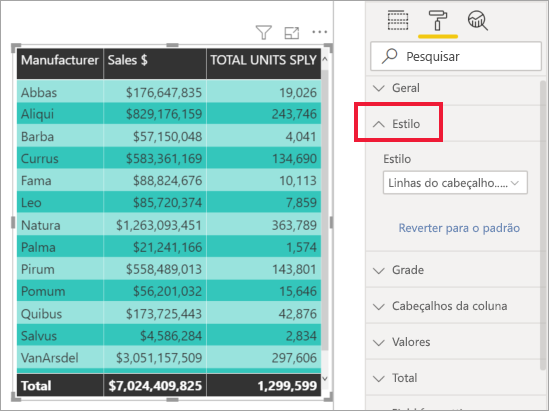

Experimente outras opções de formatação de cores. Nesta imagem, alteramos a cor do plano de fundo em **Cabeçalhos de coluna** e alteramos a **Cor de plano de fundo** e a **Cor de plano de fundo alternativa** para os **Valores** (linhas).

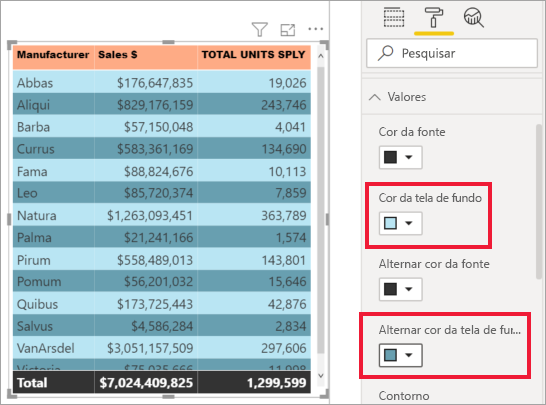

## Como desfazer no Power BI
Como muitos outros serviços da Microsoft e o software, o Power BI fornece uma maneira fácil para desfazer o último comando. Por exemplo, vamos dizer que você altera a cor de um ponto de dados ou uma série de pontos de dados, e você não gosta de cor quando ele for exibido na visualização. Você não lembra exatamente qual cor era antes, mas você sabe que deseja voltar àquela cor!

Para **Desfazer** a última ação ou as últimas ações, você precisa apenas digitar CTRL+Z.

Para descartar todas as alterações feitas em um Cartão de formatação, selecione **Reverter para o padrão**.

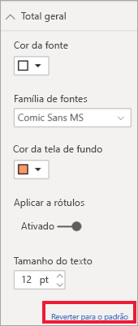

## Comentários
Você tem uma dica que gostaria de compartilhar? Envie para nós e veremos sobre adicioná-la à lista.

## Próximas etapas
[Introdução com propriedades de eixo e formatação de cor](service-getting-started-with-color-formatting-and-axis-properties.md)

[Compartilhamento de relatórios](../collaborate-share/service-share-reports.md).

